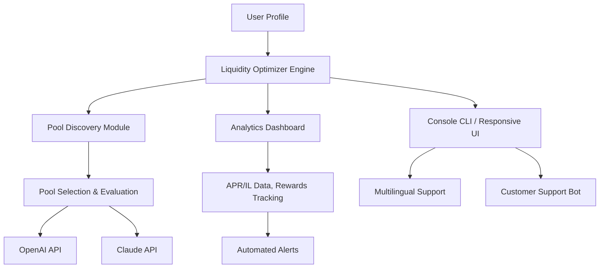

# megaETH-GTE Auto-Liquidity Optimizer

🔁 **DESCRIPTION:**  
Automate the discovery, evaluation, and management of liquidity pools across the megaETH decentralized exchange ecosystem. With advanced analytics, customizable pool strategies, and seamless integration with popular bots, achieve optimal returns and transparent operations on megaETH.

---

## 🌟 Table of Contents

- [Overview](#-overview)
- [Features](#-features)
- [Mermaid Diagram: System Overview](#-mermaid-diagram-system-overview)
- [SEO-Friendly Keyword Integration](#-seo-friendly-keyword-integration)
- [Getting Started](#-getting-started)
- [Example Profile Configuration](#-example-profile-configuration)
- [Example Console Invocation](#-example-console-invocation)
- [OS Compatibility Table](#-os-compatibility-table)
- [OpenAI and Claude API Integration](#-openai-and-claude-api-integration)
- [License](#-license)
- [Disclaimer](#-disclaimer)
- [Download](#-download)

---

## ✨ Overview

**megaETH-GTE Auto-Liquidity Optimizer** is your algorithmic Swiss army knife for maximizing yield and reducing risks on the megaETH DEX. From real-time ROI analysis to automated liquidity provision and removal, this software embodies the next generation of DeFi automation, analysis, and transparency.

This tool:
- Identifies the most promising megaETH liquidity pools
- Tracks rewards, impermanent loss, and pool health in real-time
- Allows custom strategies based on personal risk appetite
- Integrates with both OpenAI and Claude APIs for intelligent portfolio insights

---

## 🧰 Features

- 🔍 **Automated Pool Discovery:** Scans for new megaETH liquidity pools, flagging the most promising ones.
- 🏆 **Real-Time Analytics:** Tracks APR, impermanent loss, pool volume, and TVL in one intuitive dashboard.
- 🛡️ **Custom Pool Selection Strategies:** Choose between aggressive growth, stability-focused, or even create your own.
- 🧑‍💻 **API-Powered Insights:** Leverage OpenAI and Claude for tailored liquidity suggestions and risk assessments.
- 🌏 **Multilingual UI:** Supports English, Chinese, Spanish, and more.
- 💬 **24/7 Customer Support:** Automated support bot + direct community channel, always ready to assist.
- 💾 **Continuous Logging:** Every action and event recorded for peace of mind and auditing.
- ♻️ **Dynamic Pool Rebalancing:** Automatically migrate liquidity as market opportunities shift.
- 🖥️ **Responsive UI:** Whether desktop, tablet, or mobile, manage your liquidity universe with flexibility.

---

## 📈 Mermaid Diagram: System Overview

---

## 🏵️ SEO-Friendly Keyword Integration

Maximize your DeFi returns with automated megaETH liquidity management  
Yield optimization for megaETH DEX  
Automated DeFi liquidity pool manager  
Real-time analytics for DEX pools  
AI-powered yield farming strategies  
Continuous liquidity management and performance tracking  
Multilingual DeFi dashboard  
megaETH ecosystem tool for automated rewards  
Secure and transparent liquidity optimization

---

## 🚀 Getting Started

Ready to amplify your megaETH exposure? Follow these steps:

1. **Download the latest release:**  
   

2. **Install required dependencies:**
   - Node.js ≥ 20.x
   - Python ≥ 3.10
   - [megaETH network wallet]
   - API access for OpenAI and Claude (see below)

3. **Copy & edit the example `.config.yaml` (see below).**

4. **Launch the Optimizer via CLI.**

---

## 📋 Example Profile Configuration

Below is an example `.config.yaml` for the optimizer:

    profile:
      wallet_address: "0x12345...abcd"
      strategy: "balanced"
      min_apr: 15.0
      max_il: 5.0
      pool_whitelist:
        - "ETH-cUSD"
        - "wBTC-ETH"
      auto_compound: true
      logging: "full"
    language: "en"
    openai_api_key: "<your_api_key>"
    claude_api_key: "<your_api_key>"
    notification_email: "notify@example.com"

---

## 💻 Example Console Invocation

    $ python3 optimizer.py --config ./config.yaml --ui responsive
      MegaETH Auto-Liquidity Optimizer starting up...
      [2026-07-22 09:03:10] Loading user profile...
      [2026-07-22 09:03:11] Connected to megaETH. Scanning pools...
      [2026-07-22 09:03:15] Evaluating pool: ETH-cUSD [APR: 18.3%, IL: 3.2%]
      [2026-07-22 09:03:16] Pool ETH-cUSD meets strategy criteria. Acting...
      [2026-07-22 09:03:21] All actions logged in ./logs/2026-07-22.log

---

## 🖥️ Emoji OS Compatibility Table

| 📝 Platform    | ✅ Supported | 🛠️ Minor Issues | ❌ Not Supported |
|----------------|:-----------:|:---------------:|:---------------:|
| 🪟 Windows     |      ✅      |                 |                 |
| 🐧 Linux       |      ✅      |                 |                 |
| 🍏 macOS       |      ✅      |                 |                 |
| 📱 Android     |      ✅      |                 |                 |
| 📱 iOS         |             |        🛠️        |                 |

---

## 🤖 OpenAI and Claude API Integration

- **OpenAI GPT Integration:**  
  Unlock AI-powered pool scoring, risk analysis, and plain-language explanations.

- **Claude API Integration:**  
  Receive contextual strategy suggestions and deep-dive analytics, customized to your personal profile.

Simply add your API keys in the config to enable these advanced features! Both APIs grant you the wisdom of the world's finest AI teams for your liquidity automations.

---

## 📬 24/7 Support & Multilingual Assistance

- Integrated chatbot answers common configuration, strategy, and troubleshooting questions.
- International community forum linked directly in the UI.
- English 🇬🇧, 中文 🇨🇳, Español 🇪🇸, and more available.
- Reach dedicated support anytime within the app (see Support menu).

---

## 📃 License

Distributed under the MIT License.  
See [LICENSE](https://opensource.org/licenses/MIT) for more information.  
© 2026 megaETH Contributors

---

## ⚠️ Disclaimer

This software is provided “as is”, to be used at your own discretion and risk. Crypto asset values and DeFi protocols are volatile; always double-check your strategies and be aware of possible market risks, smart contract bugs, and API changes. 24/7 support is available for technical questions only — not investment advisory.

---

## ⬇️ Download

---